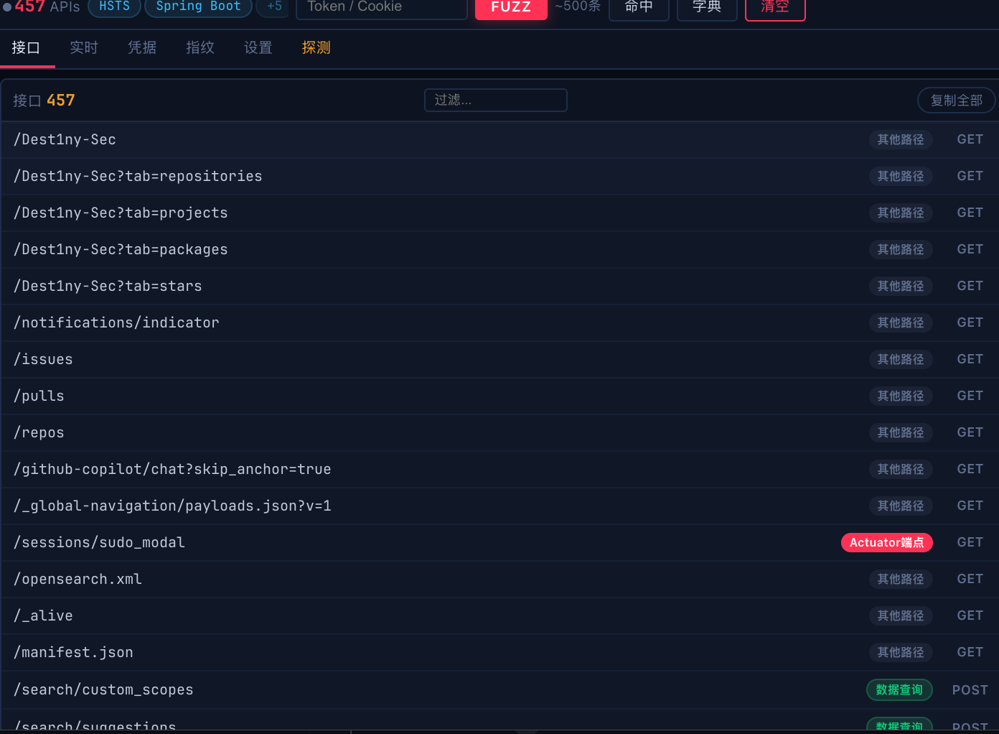
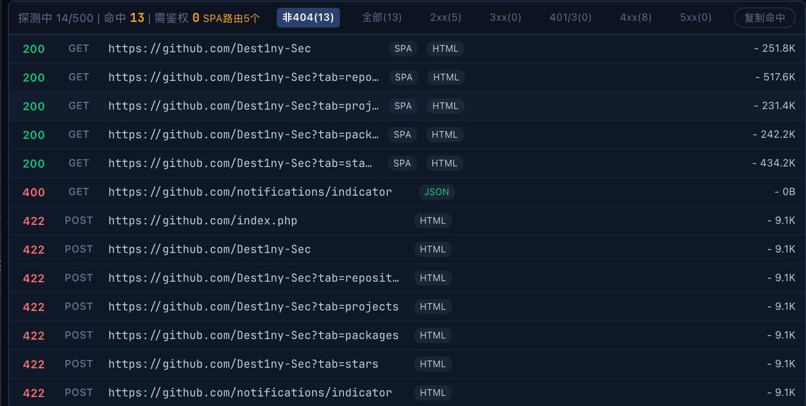
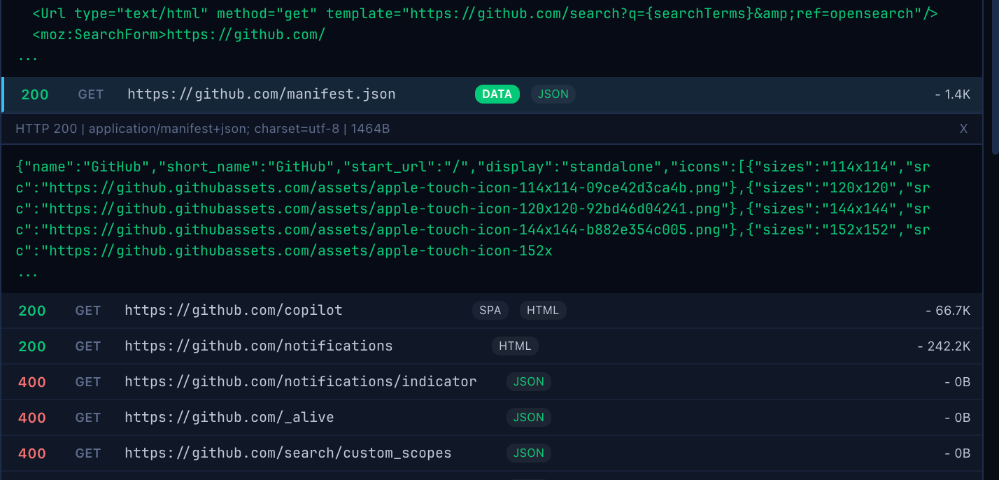

# DesJsFinder v1.3

> 被动 JS 分析 + 动态扫描 + 深度扫描 + Wappalyzer 指纹识别 + 主动 Fuzz + 响应指纹 — 红队 API 挖掘利器

## 截图

| API 接口采集 | Fuzz 探测 | 实战效果 |
|:---:|:---:|:---:|
|  |  |  |

## 功能

### 被动信息收集

打开目标网站即可自动采集，无需任何操作：

- **JS 资源拦截** — 自动下载页面所有 JS 文件（含内联脚本、modulepreload），正则提取隐藏 API 路径
- **动态扫描** — MutationObserver 监听 DOM 变化 + SPA 路由劫持（pushState / replaceState / popstate / hashchange），自动增量采集
- **深度扫描** — 递归分析 JS 中的 `import()` / `require()` 引用，Webpack chunk 路径自动推断和还原

### Wappalyzer 指纹识别

集成 [Wappalyzer](https://github.com/wappalyzer/wappalyzer) 开源指纹数据库，**3774 种技术 × 7925 条规则**，五种信号源：

| 信号源 | 规则数 | 示例 |
|--------|:---:|------|
| scriptSrc | 49,445 | react.js → React，jquery.js → jQuery |
| HTML | 11,937 | `<meta generator="WordPress">`，`data-v-` → Vue |
| JS 全局变量 | 3,025 | `window.Vue`，`window.jQuery`，`__NEXT_DATA__` |
| HTTP 响应头 | 495 | `Server: nginx`，`X-Powered-By: ThinkPHP` |
| Cookie | 227 | `PHPSESSID` → PHP，`laravel_session` → Laravel |

自动识别：Vue / React / Angular / Next.js / Nuxt / jQuery / Bootstrap / Spring / ThinkPHP / Laravel / Django / Flask / FastAPI / ASP.NET / Shiro / Nginx / Apache / IIS / Cloudflare 等数千种技术栈。

### 内置框架检测

20 种框架关键词匹配 + HTTP 响应头分析 + Cookie 指纹：

- **后端框架**：芋道 Yudao / 若依 Ruoyi / Spring Boot / Spring Cloud / ThinkPHP / Laravel / Django / Flask / FastAPI / ASP.NET
- **前端框架**：Vue.js / React / Angular / Next.js / Nuxt
- **构建工具**：Webpack / Vite
- **组件库**：jQuery / ECharts / Element UI / Ant Design
- **安全框架**：Apache Shiro

自动提取框架配置：`VITE_GLOB_API_URL_PREFIX`、`baseURL`、`apiHost` 等。

### 响应指纹识别

20 种漏洞指纹，Fuzz 时自动匹配响应体：

| 指纹 | 风险 | 说明 |
|------|:---:|------|
| Actuator 暴露 | CRITICAL | Spring Boot Actuator 端点未授权 |
| SQL 报错 | CRITICAL | 响应中包含 SQL 语法错误 — 疑似注入点 |
| Git 泄露 | CRITICAL | `.git/HEAD` 可访问 |
| 凭据泄露 | CRITICAL | 响应中泄露数据库密码、AK/SK、JWT 等 |
| ThinkPHP 报错 | CRITICAL | ThinkPHP 框架调试信息泄露 |
| Debug 模式 | HIGH | 应用运行在 Debug / 开发模式 |
| 神策 Debug | HIGH | Sensors Analytics Debug 模式开启 |
| Swagger 文档 | HIGH | API 文档公开可访问 |
| CORS 全开放 | MEDIUM | `Access-Control-Allow-Origin: *` |
| 目录遍历 | MEDIUM | Web 服务器目录列表开启 |
| Cookie 无 HttpOnly | MEDIUM | 会话 Cookie 未设置安全标志 |
| 500 错误 | MEDIUM | 服务端异常，参数可能可控 |

### HTTP 头指纹

TideFinger 5337 条关键词 + 内置 16 条正则，识别 Server / X-Powered-By / X-AspNet-Version / Set-Cookie 等响应头，推断 Apache / Nginx / IIS / Jetty / OpenResty / Tengine / Cloudflare / PHP / Java / Python / Express 等。

### 路径分类

16 类自动标注 + 风险评级（CRITICAL / HIGH / MEDIUM / INFO）：

Actuator 端点 / 认证鉴权 / 文件上传 / 管理后台 / 交易支付 / 用户管理 / API 文档 / 数据查询 / 数据写入 / 基础设施 / 第三方对接 / 敏感文件 / 消息发送 / 工作流 / 业务模块 / 其他 API

### 主动 Fuzz

- **字典生成**：16 种框架专用模板 + 通用敏感路径字典 + 已发现路径变形 + 参数组合 + CRUD 推理
- **并发探测**：5 并发，50ms 间隔，自动去重
- **Token 注入**：支持自定义 Header（Authorization / Cookie / 自定义），自动捕获页面认证头
- **Offscreen 请求**：Cookie 感知通道 + declarativeNetRequest 网络层动态 Header 注入，绕过 CORS
- **三层降级**：Service Worker fetch → offscreen document → 页面注入，确保请求可达
- **代理联动**：支持 HTTP / SOCKS 代理，配合 Burp Suite 使用
- **响应预览**：点击 Fuzz 结果行展开响应体，JSON 自动格式化
- **结果筛选**：非 404 / 2xx / 3xx / 401&403 / 4xx / 5xx 一键过滤
- **SPA 检测**：自动识别 SPA 应用的前端路由 200 响应，标记区分

## 技术栈检测示例

| 目标 | 自动识别 |
|------|---------|
| 若依后台 | Ruoyi + Spring Boot + Java + Nginx |
| 芋道系统 | Yudao + Vue.js + Spring Boot + MySQL |
| Laravel 站点 | Laravel + PHP + Nginx + jQuery |
| ThinkPHP 站点 | ThinkPHP + PHP + Apache |
| WordPress 博客 | WordPress + PHP + MySQL + Nginx |
| React SPA | React + Webpack + Node.js + CDN |
| Next.js 站点 | Next.js + React + Webpack + Vercel |

## 安装

```bash
git clone https://github.com/Dest1ny-Sec/DesJsFinder.git
```

Chrome → `chrome://extensions` → 开启「开发者模式」→ 「加载已解压的扩展程序」→ 选择项目文件夹。

## 使用

### 被动收集

打开目标站 → 插件图标实时显示 API 数量 → 点击图标查看详情。所有信息自动收集，无需操作。

### 主动 Fuzz

1. （可选）在顶部输入框粘贴 Token：
   ```
   Authorization: Bearer eyJhbGciOi...
   Cookie: JSESSIONID=abc123
   ```
2. 点击 **FUZZ** 按钮
3. 自动生成字典并发探测，实时显示结果
4. 点击结果行展开响应体，切换筛选器查看不同状态码

### 指纹查看

切换到「指纹」Tab，查看 Wappalyzer + 内置框架检测 + HTTP 头指纹的合并结果，含置信度和版本号。

## 架构

```
injector.js (MAIN world)
  ├─ fetch / XMLHttpRequest monkey-patch → 拦截运行时 API 请求
  └─ JS globals 扫描 → 发送到 content script

content.js (ISOLATED world)
  ├─ 提取 JS URL + 内联脚本 + DOM 属性路径
  ├─ Wappalyzer 引擎 → 3774 种技术指纹检测
  ├─ 20 种框架检测 + 配置提取
  ├─ 域名 / IP / 手机号 / 邮箱 / JWT / 凭据提取
  ├─ MutationObserver 动态扫描 + SPA 路由劫持
  └─ 发送到 background

background.js (Service Worker)
  ├─ 下载 JS → 提取 API → 框架识别 → 指纹识别 → Badge 计数
  ├─ TideFinger 5337 条 Header 关键词匹配
  ├─ HTTP 头 / Cookie 指纹识别
  ├─ fuzzURL: fetch → offscreen document → 页面注入（三层降级）
  └─ declarativeNetRequest 动态 Header 注入

offscreen.html / offscreen.js
  └─ Cookie 感知请求通道 (credentials:'include')

popup.html / popup.js
  └─ 6 Tab UI (接口 / 实时 / 凭据 / 指纹 / 设置 / 探测)

filters/
  ├─ wappalyzer-data.json       3774 种技术指纹 (1.3MB)
  ├─ wappalyzer-engine.js       检测引擎 (HTML/scriptSrc/JS/Header/Cookie)
  ├─ api-filter.js              路径提取 + 16 类分类 + HTTP 方法推测
  ├─ framework-detect.js        20 种框架 + 配置提取
  ├─ response-fingerprint.js    20 种响应指纹
  └─ tide-fingerprint.js        5337 条 Header 关键词

src/core/
  └─ dict-generator.js          16 种框架字典 + 通用字典 + CRUD 推理
```

## 致谢

- [Wappalyzer](https://github.com/wappalyzer/wappalyzer) — 开源技术指纹库
- [Phantom](https://github.com/Team-intN18-SoybeanSeclab/Phantom) — Offscreen 请求架构借鉴
- [FindSomething](https://github.com/residual/FindSomething) — 被动扫描思路
- [SnowEyes](https://github.com/SickleSec/SnowEyes) — 动态扫描 / HTTP 头指纹 / 网站解析
- [JSFinder](https://github.com/Threezh1/JSFinder) — URL 提取算法

## License

MIT — Dest1ny
