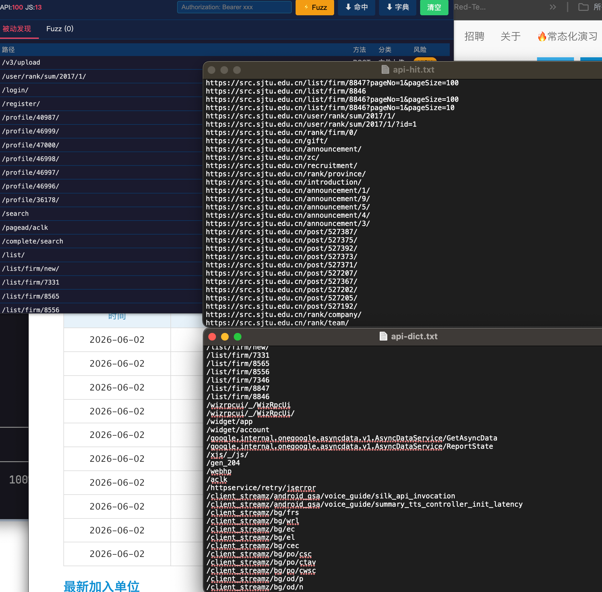
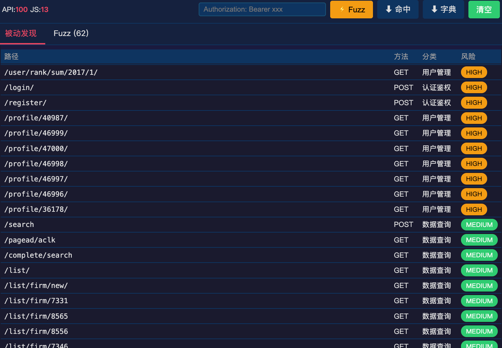
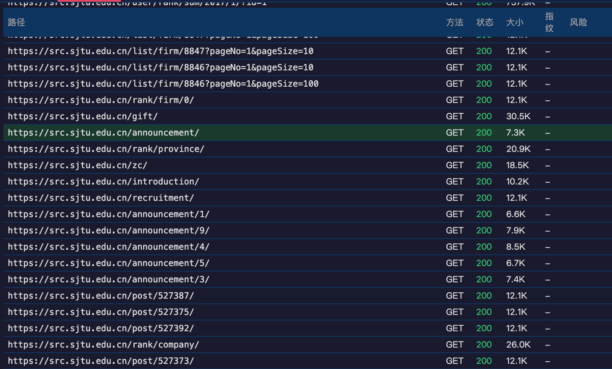
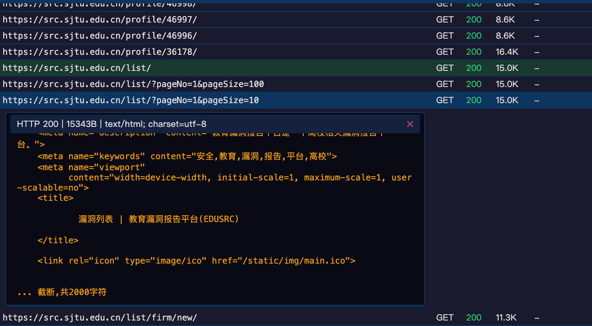

# DesJsFinder

> 红队级隐藏API发现工具 — 被动JS分析 + 框架识别 + 主动Fuzz + 响应指纹



## 功能

| 功能 | 说明 |
|------|------|
| **被动发现** | 浏览网页时自动拦截JS资源，提取所有隐藏API路径，图标实时显示发现数量 |
| **框架识别** | 自动识别芋道Yudao / Spring Boot / ThinkPHP / ASP.NET / Laravel / Shiro / Vue / React 等10种框架 |
| **路径分类** | 按风险自动标注：认证鉴权(CRITICAL) / 管理后台(CRITICAL) / 交易支付(CRITICAL) / 用户管理(HIGH) / 数据查询(MEDIUM) |
| **一键Fuzz** | 框架字典 + 路径变形 + 参数组合 + 并发探测，过滤404，只留有效接口 |
| **响应指纹** | 16种指纹自动识别 — Actuator暴露、SQL报错、凭据泄露、ThinkPHP调试、神策Debug等 |
| **Token注入** | 支持自定义Header，一键带Token探测所有接口 |
| **响应预览** | 点击Fuzz结果行展开查看响应体，JSON自动格式化 |
| **导出字典** | 一键导出命中接口 或 完整字典为txt文件 |

---

## 安装

```
1. git clone https://github.com/Dest1ny/DesJsFinder.git
2. Chrome → chrome://extensions → 开启"开发者模式"
3. 加载已解压的扩展程序 → 选择 api-fuzzer-pro 文件夹
4. 打开任意网站，插件图标自动显示数字
```

---

## 使用

### 被动模式（自动）



浏览器打开目标站 → 插件图标实时显示API数量 → 点图标查看详情

- 自动拦截页面所有JS文件（含内联脚本）
- 正则提取以 `/api/` `/v1/` `/admin-api/` 等开头的路径
- 按风险等级排序（CRITICAL排最前面）

### 主动Fuzz



1. 点 ⚡ Fuzz 按钮
2. 插件自动生成字典（框架模板 + 路径变形 + 参数组合 + 前缀推断）
3. 并发探测每个接口
4. 过滤404和SPA噪音
5. 点击任意结果行 → 展开查看响应内容

### 带Token探测



在顶部输入框粘贴 `Authorization: Bearer xxx` → Fuzz → 所有请求自动带Token

支持多个Header，每行一个：
```
Authorization: Bearer eyJhbGciOi...
Cookie: JSESSIONID=abc123
X-App-Id: sephora
```

### 导出

- ⬇ 命中 — 导出Fuzz确认存在的接口列表
- ⬇ 字典 — 导出完整字典（可用于Burp/SQLMap）

---

## 框架识别

| 框架 | 识别特征 | 字典特点 |
|------|---------|---------|
| **芋道Yudao** | `/admin-api/`, `VITE_GLOB_API_URL_PREFIX` | 80+ 接口(/system/user/page, /infra/file/upload, /bpm/task/my...) |
| **Spring Boot** | `Whitelabel Error Page`, `actuator` | actuator完整端点 + swagger + druid |
| **ThinkPHP** | `thinkphp`, `runtime/log` | 日志泄露 + RCE路径 |
| **ASP.NET** | `__VIEWSTATE`, `IIS` | web.config + elmah.axd + trace.axd |
| **Vue/React** | `vue`, `react-dom`, `webpackJsonp` | /api/v1/ /api/v2/ 常见路径 |

---

## 响应指纹

| 指纹 | 风险 | 示例 |
|------|------|------|
| Actuator暴露 | CRITICAL | `{"_links":{"heapdump"...` |
| SQL错误 | CRITICAL | `SQL syntax`, `mysql_fetch` |
| 凭据泄露 | CRITICAL | `jdbc:mysql://`, `mongodb://` |
| ThinkPHP报错 | CRITICAL | `ThinkPHP` 堆栈信息 |
| Spring错误页 | HIGH | `Whitelabel Error Page` |
| API文档 | HIGH | `swagger`, `api-docs` |
| 神策Debug | HIGH | `Sensors Analytics is ready` |

---

## 架构

```
content.js  →  提取页面JS URL + 内联脚本 → 发送background
background.js → 下载JS → 提取API → 框架识别 → Badge计数
popup.html/js → 秒开展示缓存 + 每1.5s拉新数据 + 一键Fuzz
filters/
  api-filter.js          → 路径提取 + 分类 + 方法推测
  framework-detect.js    → 10种框架识别 + 配置提取
  response-fingerprint.js → 16种响应指纹识别
src/core/
  dict-generator.js      → 框架字典 + 路径变形 + 参数组合
```

---

## 对比

| 特性 | FindSomething | Phantom幻影 | **DesJsFinder** |
|------|:---:|:---:|:---:|
| 被动收集JS路径 | ✅ | ✅ | ✅ |
| 内联脚本提取 | ❌ | ❌ | ✅ |
| 框架识别 | ❌ | ❌ | ✅ 10种 |
| 路径分类+风险评级 | ❌ | ❌ | ✅ |
| 响应指纹 | ❌ | ❌ | ✅ 16种 |
| 主动Fuzz | ❌ | ✅ | ✅ |
| 参数组合探测 | ❌ | ❌ | ✅ |
| Token注入 | ❌ | ✅ | ✅ |
| 响应内容预览 | ❌ | ❌ | ✅ |

---

## 谢谢

- [FindSomething](https://github.com/residual/FindSomething) — 被动扫描思路
- [Phantom幻影](https://github.com/Xuan8a1/Phantom) — 模块化架构借鉴

---

## License

MIT — Dest1ny
