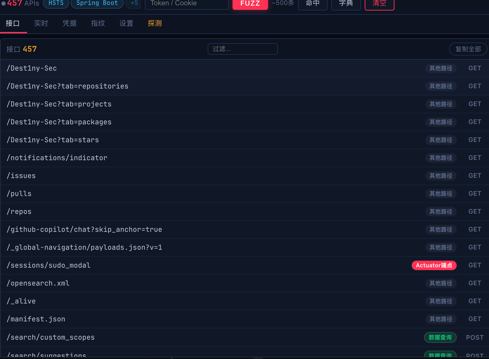
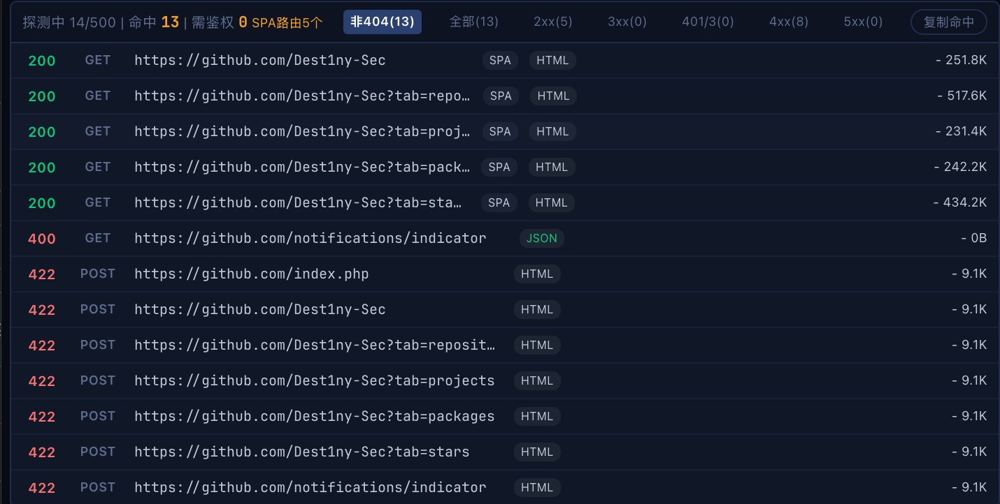
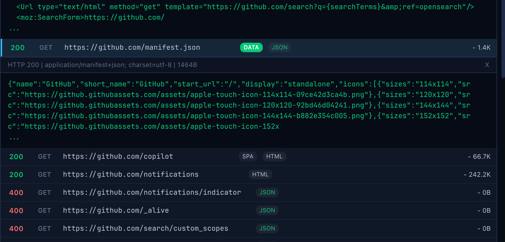

<div align="center">

<div style="background: #0B0E14; padding: 56px 64px 40px 64px; border-radius: 8px; font-family: -apple-system, BlinkMacSystemFont, 'Segoe UI', 'PingFang SC', sans-serif; color: #F5F1E8;">

<h1 style="font-size: 64px; font-weight: 800; color: #F5F1E8; margin: 0 0 16px 0; letter-spacing: 0.5px;">DesJsFinder</h1>

<p style="font-size: 22px; color: #C9C5BC; margin: 0 0 4px 0; font-weight: 600;">红队 API 挖掘利器 — 被动采集 × 主动 Fuzz × 指纹识别</p>
<p style="font-size: 16px; color: #8A93A6; margin: 0 0 28px 0; font-family: ui-monospace, SFMono-Regular, Menlo, Consolas, monospace;">Red-team API miner · JS-driven asset discovery</p>

<p style="font-size: 20px; margin: 0 0 24px 0; line-height: 1.6;"><span style="color:#8A93A6; font-weight:400; font-family: ui-monospace, SFMono-Regular, Menlo, Consolas, monospace;">装扩展</span>&nbsp;&nbsp;<span style="color:#5C6370; font-weight:400; font-family: ui-monospace, SFMono-Regular, Menlo, Consolas, monospace;">→</span>&nbsp;&nbsp;<span style="color:#8A93A6; font-weight:400; font-family: ui-monospace, SFMono-Regular, Menlo, Consolas, monospace;">浏览目标</span>&nbsp;&nbsp;<span style="color:#5C6370; font-weight:400; font-family: ui-monospace, SFMono-Regular, Menlo, Consolas, monospace;">→</span>&nbsp;&nbsp;<span style="color:#7C5CFF; font-weight:700; font-family: ui-monospace, SFMono-Regular, Menlo, Consolas, monospace;">自动采 JS</span>&nbsp;&nbsp;<span style="color:#5C6370; font-weight:400; font-family: ui-monospace, SFMono-Regular, Menlo, Consolas, monospace;">→</span>&nbsp;&nbsp;<span style="color:#8A93A6; font-weight:400; font-family: ui-monospace, SFMono-Regular, Menlo, Consolas, monospace;">提取 API</span></p>

<p style="font-size: 16px; color: #8A93A6; margin: 0 0 28px 0; line-height: 1.7;">从 JS 出发，把每一个目标站拆给你看。</p>

<p style="font-size: 14px; color: #5C6370; margin: 0; font-family: ui-monospace, SFMono-Regular, Menlo, Consolas, monospace; letter-spacing: 0.5px;">
<strong style="color:#7C5CFF;">11+</strong> 内置 fingerprint &nbsp;·&nbsp; <strong style="color:#7C5CFF;">0</strong> 配置 &nbsp;·&nbsp; <strong style="color:#7C5CFF;">1-click</strong> 导出
</p>

<p style="font-size: 13px; color: #5C6370; margin: 8px 0 0 0; font-family: ui-monospace, SFMono-Regular, Menlo, Consolas, monospace;">JavaScript · Manifest V3 · Chrome / Edge / Brave</p>

</div>

<br/>

## stacks

<div align="center">
  
</div>


<div align="center">
  
</div>

<br/>

<sub>为挖洞人写，为挖洞人用 · MIT License · 2024-2026</sub>

---

## 📑 目录

| | | |
|:---:|:---|:---|
| [🎬 截图速览](#-截图速览) | [🎯 它能干什么](#-它能干什么) | [✨ 核心特性](#-核心特性) |
| [🚀 快速开始](#-快速开始-30-秒) | [📖 使用文档](#-使用文档) | [🏗 架构设计](#-架构设计) |
| [🧪 检测示例](#-技术栈检测示例) | [📋 标签准确性说明](#-标签准确性说明) | [📝 更新日志](#-更新日志) |
| [🆚 同类对比](#-与同类工具对比) | [🤝 致谢](#-致谢) | [📜 License](#-license) |

---

## 🎬 截图速览

| 接口采集 | Fuzz 探测 | 指纹 / 实战 |
|:---:|:---:|:---:|
|  |  |  |

> **暗色 HUD 风格** · 蓝图网格 · 扫描线 · LED 脉冲 · **Phosphor 1.6-stroke SVG 图标**

---

## 🎯 它能干什么

打开目标站，**插件自动开始干活**——下载 JS、提取 API、识别框架、收集凭据。需要主动挖的时候，按一下 **FUZZ**，字典 + runtime 参数 + 路径变形一并打过去。

> 💡 **核心理念：被动优先，Fuzz 按需。** 90% 的 API 在浏览时就拿到了，Fuzz 只是补全 + 主动验证。

---

## ✨ 核心特性

### 🟢 被动采集 — 打开页面就在干活

<details>
<summary><b>👇 6 大被动能力，零操作全开</b></summary>

| 模块 | 干了啥 |
|---|---|
| **JS 资源拦截** | 自动下载所有 JS（含内联、modulepreload、动态 import），6-pattern 正则提取隐藏 API |
| **运行时 API 捕获** | `fetch` / `XMLHttpRequest` monkey-patch（MAIN world），抓到响应体再做关键词提取 |
| **JS 参数提取** | 集成 [ParamX](https://github.com/daydust/ParamX) 引擎 — 9 种策略 × 4 类评分，一键构造 POST-JSON / GET 查询串 |
| **动态扫描** | `MutationObserver` + SPA 路由劫持（pushState / replaceState / popstate / hashchange）+ iframe 监听 |
| **深度扫描** | Webpack chunk 路径自动还原、import/require 递归 |
| **凭据捕获** | 域名 / IP / 手机 / 邮箱 / JWT / 凭据 / GitHub repo / 公司名 / Cookie / localStorage 敏感项 |

</details>

### 🟡 指纹识别 — 4 套引擎并联

<details>
<summary><b>👇 同时跑 4 套，去重打分</b></summary>

- **🔬 Wappalyzer 引擎** — `3,774` 种技术 × `7,925` 条规则，5 种信号源（scriptSrc / HTML / JS globals / Header / Cookie）
- **🎯 内置框架检测** — `40+` 框架：芋道 / 若依 / Spring Boot / Cloud / ThinkPHP / Laravel / FastAPI / Django / Flask / ASP.NET / Shiro / Vue / React / Next.js / Webpack / Vite / ECharts / jQuery / Node.js / Jenkins / ES / Kibana / Swagger / Docker …
- **🪪 HTTP 头指纹** — TideFinger `5,337` 条关键词 + 16 条内置正则
- **🚨 响应指纹** — `20` 种漏洞指纹（Actuator / SQL 报错 / Git 泄露 / 凭据泄露 / ThinkPHP 报错 / Debug 模式 / Swagger / CORS / 目录遍历 / Cookie 无 HttpOnly / 500 错误 …）

</details>

### 🔴 主动 Fuzz — 按 FUZZ 一键打

<details>
<summary><b>👇 字典 + 变形 + 参数 + 限速全配齐</b></summary>

- **📚 字典生成** — `16` 种框架专用模板 + 通用 fuzzdicts 精选 + 已发现路径变形 + runtime 参数 + CRUD 推理
- **🌐 三级降级** — Service Worker fetch → offscreen document（带 Cookie）→ 页面注入（绕过 CORS）
- **⏱️ 速率档位** — 慢 1 并发 / 常 3 并发 / 快 5 并发，避开 WAF 限速
- **🔌 代理联动** — HTTP / SOCKS 代理，配合 Burp Suite
- **👁️ 响应预览** — 点击行展开响应体，JSON 自动格式化
- **🎯 结果筛选** — 非 404 / 2xx / 3xx / 401&403 / 4xx / 5xx 一键过滤
- **🌀 SPA 识别** — 3+ 相同响应体自动标记为 SPA 路由，避免噪音

</details>

### 🛠 路径分类 + 攻击提示

- **16 类自动标注** — Actuator / 认证鉴权 / 文件上传 / 管理后台 / 交易支付 / 用户管理 / API 文档 / 数据查询 / 写入 / 基础设施 / 第三方对接 / 敏感文件 / 消息发送 / 工作流 / 业务模块，附风险评级（`CRITICAL` / `HIGH` / `MEDIUM` / `INFO`）
- **框架攻击路径** — 命中 Spring / ThinkPHP / Laravel / Yudao / Ruoyi / FastAPI / Jenkins / ES / Kibana … 时自动弹提示，列出已知 RCE / 未授权端点

---

## 🚀 快速开始 (30 秒)

```bash
# 1. 克隆
git clone https://github.com/Dest1ny-Sec/DesJsFinder.git

# 2. 打开 Chrome 扩展页
# 地址栏输入: chrome://extensions

# 3. 打开「开发者模式」→ 「加载已解压的扩展程序」→ 选项目文件夹
```

> 📋 **需要 Manifest V3 权限**：`storage` / `scripting` / `activeTab` / `webRequest` / `proxy` / `offscreen` / `declarativeNetRequestWithHostAccess`

### 三步上手

```
1️⃣  打开目标站          → 插件自动采集 (图标实时显示 API 数量)
2️⃣  点 FUZZ 按钮        → 字典 + 路径变形 + runtime 参数一并打过去
3️⃣  点行展开响应体      → 看 JSON / HTML / 错误详情, 一键复制命中
```

---

## 📖 使用文档

### 被动收集

打开目标站 → 插件图标实时显示 API 数量 → 点击图标看详情。**全程零操作。**

### 主动 Fuzz

1. （可选）顶部输入 Token：
   ```
   Authorization: Bearer eyJhbGciOi...
   Cookie: JSESSIONID=abc123
   ```
2. 选速率档位（慢 / 常 / 快）
3. 点 **FUZZ** 按钮
4. 实时滚结果 → 点行展开响应体 → 切筛选器看不同状态码

### 指纹 / 凭据 / 站点解析

切到对应 tab，**插件把抓到的东西全列出来**——域名、IP、邮箱、JWT、凭据、GitHub repo、公司名、ICP 备案、IP 归属。

> 🔑 ICP / IP 查询需要 `cn.apihz.cn` 密钥，在「设置」里填。

---

## 🏗 架构设计

```
┌─────────────────────────────────────────────────────────┐
│  目标页面 (Tab)                                          │
│  ┌─────────────────────────────────────────────────┐    │
│  │  injector.js (MAIN world)                       │    │
│  │  ├─ fetch / XHR monkey-patch → postMessage      │    │
│  │  └─ Wappalyzer JS globals 扫描器 (每 5s)        │    │
│  └─────────────────────────────────────────────────┘    │
│  ┌─────────────────────────────────────────────────┐    │
│  │  content.js (ISOLATED world)                    │    │
│  │  ├─ 解析 JS URL + 内联脚本 + DOM 属性路径       │    │
│  │  ├─ Wappalyzer 引擎 → 3,774 种技术指纹         │    │
│  │  ├─ 40+ 框架检测 + 配置提取                     │    │
│  │  ├─ 域名 / IP / 手机 / 邮箱 / JWT / 凭据        │    │
│  │  ├─ MutationObserver 动态扫描 + SPA 路由劫持   │    │
│  │  └─ 发送到 background                           │    │
│  └─────────────────────────────────────────────────┘    │
└─────────────────────────────────────────────────────────┘
                          ↓
┌─────────────────────────────────────────────────────────┐
│  background.js (Service Worker)                         │
│  ├─ 下载 JS → 提取 API → 框架识别 → 指纹 → Badge 计数 │
│  ├─ TideFinger 5,337 条 Header 关键词匹配              │
│  ├─ fuzzURL: fetch → offscreen (带 Cookie) → scripting │
│  ├─ declarativeNetRequest 动态 Header 注入            │
│  └─ chrome.storage.local 跨重启持久化                  │
└─────────────────────────────────────────────────────────┘
                          ↓
┌─────────────────────────────────────────────────────────┐
│  popup.html / popup.js (7 Tab UI)                      │
│  接口 / 实时 / 参数 / 凭据 / 指纹 / 设置 / 探测        │
└─────────────────────────────────────────────────────────┘

filters/
  ├─ wappalyzer-data.json       3,774 种技术 × 1.3MB
  ├─ wappalyzer-engine.js       检测引擎 (HTML/scriptSrc/JS/Header/Cookie)
  ├─ api-filter.js              路径提取 + 16 类分类 + HTTP 方法推测
  ├─ framework-detect.js        40+ 框架 + 配置提取
  ├─ response-fingerprint.js    20 种响应指纹
  └─ param-extract.js           9 种提取策略 × 5 类评分 (ParamX 内核)

src/core/
  └─ dict-generator.js          16 种框架字典 + 通用字典 + CRUD 推理
```

---

## 🧪 技术栈检测示例

| 目标 | 自动识别 |
|---|---|
| 若依后台 | Ruoyi + Spring Boot + Java + Nginx |
| 芋道系统 | Yudao + Vue.js + Spring Boot + MySQL |
| Laravel 站点 | Laravel + PHP + Nginx + jQuery |
| ThinkPHP 站点 | ThinkPHP + PHP + Apache |
| WordPress 博客 | WordPress + PHP + MySQL + Nginx |
| React SPA | React + Webpack + Node.js + CDN |
| Next.js 站点 | Next.js + React + Webpack + Vercel |

---

## 📋 标签准确性说明

**两类标签，两套判定逻辑，分别说清楚：**

| 标签 | 出现位置 | 来源 | 准确性 |
|---|---|---|---|
| `SPA` / `HTML` / `JSON` / `DATA` / `需鉴权` | **Fuzz 探测结果** | 真实响应 — `Content-Type` 头 + 响应体内容 | ✅ **100% 基于实际响应**，无猜测 |
| `认证鉴权` / `管理后台` / `Actuator端点` / `文件上传` / `CRITICAL` / `HIGH` / `MEDIUM` | **API 列表（接口tab）** | JS 文本里的路径关键词匹配 | ⚠️ **启发式分类**，偶有误报，保守策略 |

**举例：**

- `https://target/api/users/me` 返回 401 → 显示 `需鉴权` 标签（基于响应状态码）
- `https://target/api/users/list` 返回 `Content-Type: application/json` + body 含 `"data":{"list":[...]}` → 显示 `DATA JSON`（基于响应内容）
- `https://target/social/{x,y,z}` 3+ 个不同路径返回相同 HTML → 全部打 `SPA` 标签（基于响应体 hash 比对）
- JS 里字符串 `/admin/login` → 被打成 `管理后台` + `HIGH`（基于关键词，可能误报——如果 `admin` 是用户名而非路径段）

> ⚠️ **不要把 API 列表的分类当成定论**，它是给红队一个"先看哪里"的优先级；**Fuzz 探测结果的标签是基于实际响应的，可以信。**

---

## 📝 更新日志

### 🚀 v1.5 (2026-08) — UX & 噪音治理

| 类别 | 改动 |
|---|---|
| 🐛 Bug | 静态资源（`.avif` / `.webmanifest` / `.wasm` 等）混入 fuzz 队列，扩展名清单统一化 |
| 🐛 Bug | URL 末尾的 `\`（JS 字符串残留的转义符）绕过静态过滤，新增 `normalizePath()` 在所有提取/去重/分类节点归一化 |
| 🐛 Bug | 跨站 fuzz 结果残留：popup 打开新站仍显示旧站结果，引入 `lastFuzzUrl` 比对 + `data.url` 变化时清空 |
| 🐛 Bug | 重复 URL（`/social/feishu\` vs `/social/feishu`）未合并，dedup 键改用归一化 URL |
| 🎨 UI | fuzz 行 URL 显示更长：method 列 32→28px、badges 7px + 圆角减半、path 用 `flex:1 min-width:0 ellipsis` 挤出 8-12 字符 |
| ⚡ 性能 | 渲染前再做一道兜底过滤，静态资源在显示层就被剔除 |
| 🔧 维护 | `STATIC_EXTS` 常量三处统一（`api-filter.js` / `background.js` / `popup.js`），加新扩展只改一处 |

### 🎨 v1.4 (2026-08) — HUD UI 改版

暗色 HUD 风格、蓝图网格、扫描线、LED 脉冲、Phosphor 风格 SVG 图标全面替换 emoji；增加 Fuzz 速率档位；事件委托优化。

### 🔧 v1.3 — JS 参数提取

集成 ParamX 引擎，9 种策略 × 4 类评分，一键构造 POST-JSON / GET 查询串。

---

## 🆚 与同类工具对比

| 工具 | 被动采集 | 主动 Fuzz | 框架识别 | Cookie 注入 | UI 体验 |
|---|:---:|:---:|:---:|:---:|:---:|
| **🛰️ DesJsFinder** | ✅ 自动 | ✅ 3 速率 | ✅ Wappalyzer | ✅ offscreen | ✅ 暗色 HUD |
| JSFinder | ✅ | ❌ | ❌ | ❌ | 命令行 |
| FindSomething | ✅ | ❌ | ❌ | ❌ | 浏览器 |
| Packer-Fuzzer | ❌ | ✅ | ❌ | ❌ | 命令行 |
| HaE | ✅ | ❌ | ❌ | ❌ | 浏览器 |
| Burp Suite | ❌ | ✅ | ❌ | ✅ | 桌面 GUI |

---

## 🤝 致谢

本项目站在以下开源巨人肩膀上：

- [Wappalyzer](https://github.com/wappalyzer/wappalyzer) — 开源技术指纹库（3,774 种技术）
- [ParamX](https://github.com/daydust/ParamX) — JS 参数提取引擎（已采纳）
- [Phantom](https://github.com/Team-intN18-SoybeanSeclab/Phantom) — Offscreen document 请求架构
- [FindSomething](https://github.com/residual/FindSomething) — 浏览器侧被动扫描思路
- [SnowEyes](https://github.com/SickleSec/SnowEyes) — 动态扫描 / HTTP 头指纹
- [JSFinder](https://github.com/Threezh1/JSFinder) — 早期 URL 提取算法
- [TideFinger](https://github.com/TideSec/TideFinger) — 5,337 条 Header 关键词
- [github-readme-stats](https://github.com/anuranhazra/github-readme-stats) — README 卡片思路

---

## 📜 License

MIT © [Dest1ny](https://github.com/Dest1ny-Sec)

---

<div align="center">

<sub>🛰️ DesJsFinder · v1.5 · 红队 API 挖掘，从 JS 出发</sub>

**⭐ 觉得好用？给个 Star 鼓励一下**

</div>
